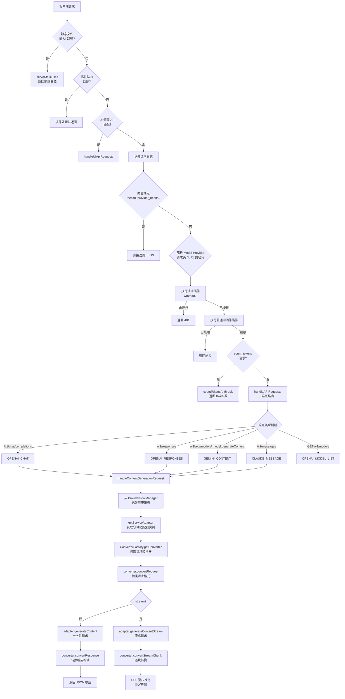
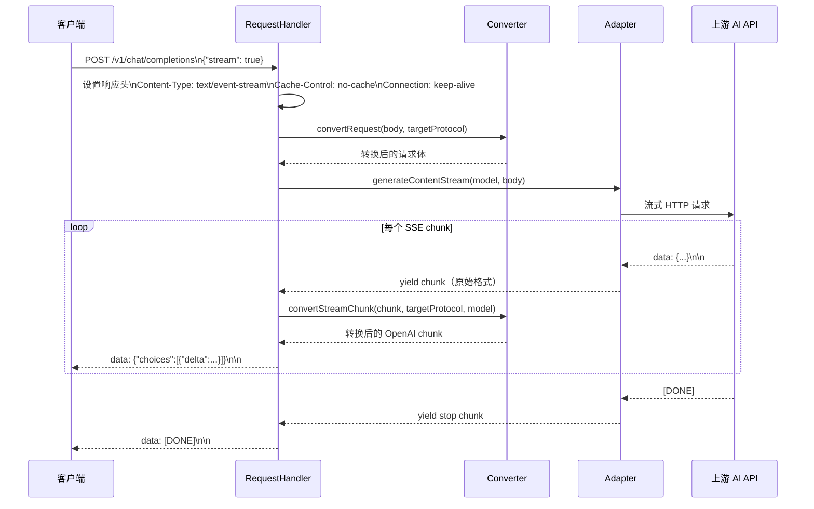
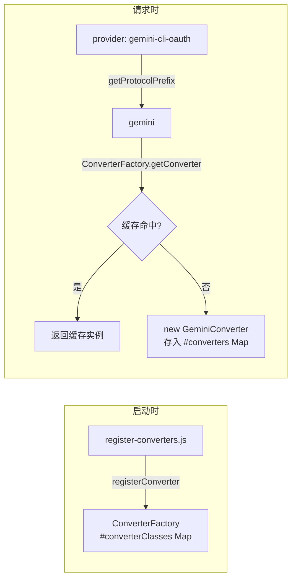
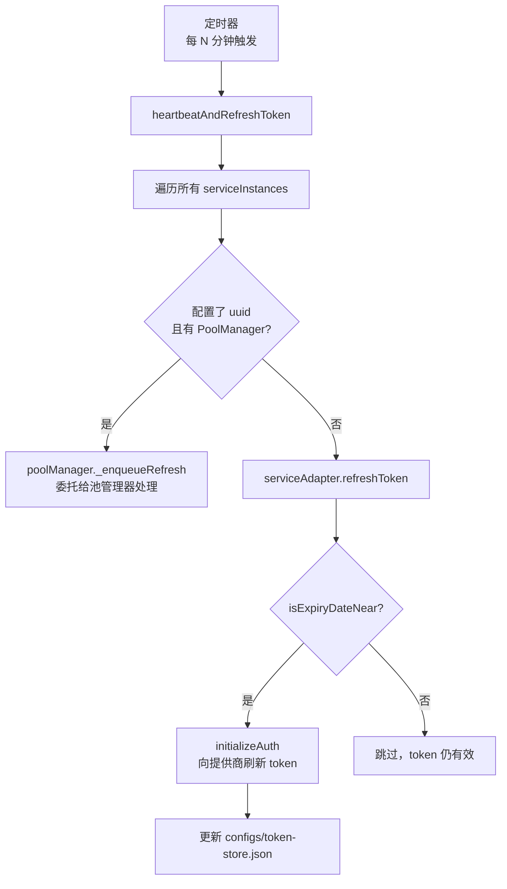

# 数据流文档

## 请求处理完整流程

### 整体流程图



### 关键步骤说明

#### 步骤 1：提供商选择

请求到达时，系统按以下优先级确定使用哪个提供商：

1. URL 路径第一段（如 `/gemini-cli-oauth/v1/chat/completions`）
2. `Model-Provider` 请求头
3. 配置文件中的 `MODEL_PROVIDER` 默认值

只有在 `adapterRegistry` 中已注册的提供商才被接受；使用 `auto` 时由账号池自动选择。

#### 步骤 2：认证

认证由插件系统处理（`type=auth` 的插件）。内置 `default-auth` 插件校验 Bearer Token，支持三种传入方式：

- `Authorization: Bearer <key>` 请求头
- `x-goog-api-key` 请求头
- `?key=<key>` URL 查询参数

#### 步骤 3：协议转换（请求方向）

`ConverterFactory` 根据目标提供商的协议前缀（通过 `getProtocolPrefix(provider)` 获取）取得对应转换器，将入站请求体转换为提供商原生格式。

#### 步骤 4：账号池选取

`ProviderPoolManager` 维护每个提供商的账号健康状态。每次请求时轮询选取健康账号，并将对应的 `uuid` 写入 `currentConfig`，以便 `getServiceAdapter` 定位到正确的适配器单例。

#### 步骤 5：协议转换（响应方向）

适配器返回提供商原生响应后，再由同一转换器将其转换为客户端期望的格式（取决于入站端点类型 `ENDPOINT_TYPE`）。

---

## SSE 流式响应处理



**关键实现细节：**

- HTTP Server 禁用 `requestTimeout`（设为 0），确保长流式响应不超时
- `keepAliveTimeout` 设为 65 秒，略大于负载均衡器的通常配置
- Worker 进程异步生成器（`async function*`）通过 `yield*` 传递流，零拷贝
- 流中断时（客户端关闭连接）`EPIPE` 等网络错误被 `isRetryableNetworkError` 拦截，不触发进程退出

---

## 协议转换流程

### 转换器注册与查找



### 支持的转换矩阵

| 入站端点类型 | 目标提供商协议 | 转换器 | 转换方向 |
|-------------|---------------|--------|---------|
| `openai_chat` | `gemini` | GeminiConverter | OpenAI → Gemini 请求；Gemini → OpenAI 响应 |
| `openai_chat` | `claude` | ClaudeConverter | OpenAI → Claude 请求；Claude → OpenAI 响应 |
| `openai_chat` | `openai` | OpenAIConverter | 透传（格式相同） |
| `openai_chat` | `grok` | GrokConverter | OpenAI → Grok 请求；Grok → OpenAI 响应 |
| `openai_chat` | `codex` | CodexConverter | OpenAI → Codex 请求；Codex → OpenAI 响应 |
| `gemini_content` | `gemini` | GeminiConverter | Gemini 原生格式透传 |
| `claude_message` | `claude` | ClaudeConverter | Claude 原生格式透传 |
| `openai_responses` | `openaiResponses` | OpenAIResponsesConverter | Responses API 格式处理 |

---

## 进程间通信（IPC）流程

```mermaid
sequenceDiagram
    participant Master :3100
    participant Worker :3000

    Master->>Worker: fork() + IS_WORKER_PROCESS=true
    Worker-->>Master: IPC: {type: "ready", pid: 1234}
    loop 心跳（每 CRON_NEAR_MINUTES 分钟）
        Worker->>Worker: heartbeatAndRefreshToken()
        Worker->>Worker: 刷新各提供商 OAuth Token
    end
    Note over Master,Worker: 异常场景
    Worker-->>Master: IPC: {type: "restart_request"}
    Master->>Worker: SIGTERM + {type: "shutdown"}
    Worker->>Worker: gracefulShutdown()\n关闭 HTTP Server
    Worker-->>Master: exit(0)
    Master->>Worker: setTimeout → fork() 重新拉起
```

---

## OAuth Token 刷新流程


