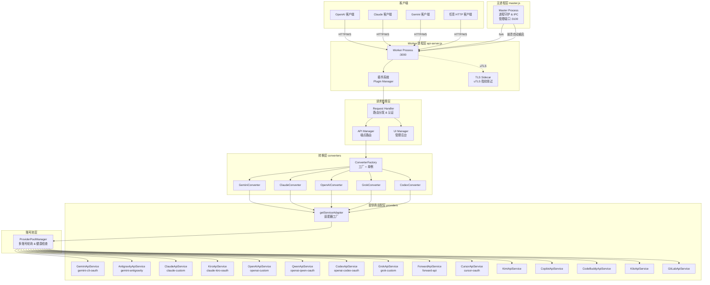

# AIClient-2-API 架构概览

## 系统概述

AIClient-2-API 是一个 Node.js API 代理网关服务，核心目标是将仅客户端工具可用的 AI 模型接口（如 Gemini CLI、GitHub Copilot、Cursor、Kiro、Qwen Code、Grok、Codex、Kimi、CodeBuddy、GitLab Duo 等）转换为标准 OpenAI 兼容接口，同时支持在 OpenAI、Claude、Gemini、Grok、Codex 等多种协议之间相互转换。

**核心价值：** 客户端 AI 工具的免费算力通过本服务统一暴露为标准 API，供任意支持 OpenAI 接口的下游工具调用。

## 核心架构图

## 主要模块说明

### 主进程层（`src/core/master.js`）

| 职责 | 说明 |
|------|------|
| 进程守护 | 通过 `child_process.fork` 拉起 Worker，监控退出事件 |
| 自动重启 | Worker 异常退出后指数退避重试，最多 10 次 |
| 管理 API | 监听 `:3100` 端口，提供 `/master/restart`、`/master/status`、`/master/health` 等管理端点 |
| IPC 通信 | 通过 Node.js IPC channel 与 Worker 双向通信，支持 `ready`、`restart_request`、`shutdown` 消息类型 |

### HTTP 服务层（`src/services/api-server.js`）

Worker 进程的主体，负责：
- 初始化配置（`ConfigManager`）
- 加载插件系统（`PluginManager`）
- 初始化所有提供商服务（`ServiceManager`）
- 启动 TLS Sidecar（可选，用于 uTLS 指纹绕过）
- 创建原生 `http.Server`，最大连接数 1000，禁用请求超时（流式响应需要）
- 设置 Codex WebSocket 中继（`/v1/responses`）
- 定时心跳与 OAuth Token 刷新

### 请求处理层（`src/handlers/request-handler.js`）

每个请求独立的处理流水线：

1. 生成请求 ID（`clientIP:UUID8`）并绑定日志上下文
2. 为每个请求 deep copy 配置对象，允许运行时动态修改
3. 处理 CORS 预检
4. 路由静态文件（UI 资源、登录页）
5. 执行插件路由
6. 处理 UI 管理 API
7. 解析 `Model-Provider` 请求头或 URL 路径段，动态切换提供商
8. 执行认证插件（`type=auth`）
9. 执行中间件插件
10. 分发到 `handleAPIRequests`

### API 管理层（`src/services/api-manager.js`）

负责将请求路由到具体端点处理函数：

| 端点 | 类型 |
|------|------|
| `GET /v1/models` | OpenAI 模型列表 |
| `GET /v1beta/models` | Gemini 模型列表 |
| `POST /v1/chat/completions` | OpenAI Chat |
| `POST /v1/responses` | OpenAI Responses |
| `POST /v1beta/models/{model}:generateContent` | Gemini 内容生成 |
| `POST /v1/messages` | Claude 消息 |

### 协议转换层（`src/converters/`）

采用策略模式 + 工厂模式：

- `BaseConverter`：抽象基类，定义 `convertRequest`、`convertResponse`、`convertStreamChunk`、`convertModelList` 四个抽象方法
- `ConverterFactory`：单例工厂，按协议前缀缓存转换器实例，支持运行时动态注册
- 具体策略类：`GeminiConverter`、`ClaudeConverter`、`OpenAIConverter`、`GrokConverter`、`CodexConverter`、`OpenAIResponsesConverter`

### 提供商适配层（`src/providers/adapter.js`）

采用适配器模式 + 注册表模式：

- `ApiServiceAdapter`：抽象基类，定义 `generateContent`、`generateContentStream`、`listModels`、`refreshToken`、`forceRefreshToken`、`isExpiryDateNear` 接口
- `adapterRegistry`（`Map`）：提供商名称 → 适配器类的注册表
- `getServiceAdapter(config)`：工厂函数，按 `provider + uuid` 键缓存单例，避免重复初始化
- 当前注册的 16 个适配器见下方提供商清单

### 账号池层（`src/services/provider-pool-manager.js`）

- 支持多账号轮询、健康检查、故障转移
- 自动将不健康的账号标记下线，在健康检查通过后恢复
- 提供 `performHealthChecks`、`markProviderUnhealthy`、`_enqueueRefresh` 等操作

### 插件系统（`src/plugins/`）

可扩展的中间件架构：
- 插件类型分为 `auth`（认证）和普通中间件
- 配置文件：`configs/plugins.json`
- 内置插件：`default-auth`、`ai-monitor`、`api-potluck`

## 支持的提供商

| 提供商 ID | 协议 | 说明 |
|-----------|------|------|
| `gemini-cli-oauth` | gemini | Gemini CLI OAuth |
| `gemini-antigravity` | gemini | Gemini Antigravity |
| `claude-custom` | claude | Claude 自定义 API Key |
| `claude-kiro-oauth` | claude | AWS Kiro OAuth |
| `openai-custom` | openai | OpenAI 兼容接口 |
| `openaiResponses-custom` | openaiResponses | OpenAI Responses API |
| `openai-qwen-oauth` | openai | 通义千问 OAuth |
| `openai-codex-oauth` | codex | OpenAI Codex OAuth + WebSocket |
| `forward-api` | forward | 纯转发（不做格式转换） |
| `grok-custom` | grok | Grok（含 uTLS 绕过） |
| `cursor-oauth` | openai | Cursor OAuth |
| `openai-copilot-oauth` | openai | GitHub Copilot OAuth |
| `openai-codebuddy-oauth` | openai | 腾讯 CodeBuddy OAuth |
| `openai-kimi-oauth` | openai | Kimi OAuth |
| `openai-gitlab-oauth` | openai | GitLab Duo OAuth |
| `openai-kilo-oauth` | openai | Kilo AI OAuth |

## 技术栈

| 技术 | 说明 |
|------|------|
| 运行时 | Node.js >= 20.0.0，ES Modules（`"type": "module"`） |
| HTTP 服务 | 原生 `node:http` 模块，无 Web 框架 |
| 包管理 | pnpm |
| 进程管理 | `child_process.fork`（主从进程模型） |
| 测试 | Jest + Babel（ESM 转换） |
| TLS 绕过 | Go 二进制 TLS Sidecar（uTLS，绕过 Cloudflare / Grok 指纹检测） |
| 配置存储 | 无数据库，`configs/` 目录下 JSON 文件 |
| 容器化 | Docker（`justlikemaki/aiclient-2-api`） |
